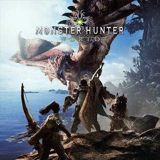

# Games Development

### Game Developer Videos

- [Classic Game Postmortem: Fallout](https://www.youtube.com/watch?v=T2OxO-4YLRk)

- [GOG: Preserving Gaming's Past & Future](https://www.youtube.com/watch?v=ffngZOB1U2A)

- [Horizon Zero Dawn - A Game Design Post-Mortem](http://www.gdcvault.com/play/1024963/-Horizon-Zero-Dawn-A)
- [Horizon Zero Dawn Documentary - Noclip](https://www.youtube.com/watch?v=h9tLcD1r-6w)

- [How to Survive in Gamedev for Eleven Years Without a Hit](https://www.youtube.com/watch?v=JmwbYl6f11c)

- [Monster Hunter World Post-mortem - Concept Design through Prototyping and Iteration](http://www.gdcvault.com/play/1024981/-Monster-Hunter-World-Postmortem)

- [Nier Automata - Design and Freedom](https://www.gdcvault.com/play/1024894/A-Fun-Time-in-Which)

- [Warframe Documentary (Part One) - The Story of Digital Extremes ](https://www.youtube.com/watch?v=UOE6528pwFc)
- [Warframe Documentary (Part Two) - The Story of Warframe ](https://www.youtube.com/watch?v=NA5vT1LooXk)

- [Zelda - Change and Constant: Breaking Conventions with 'The Legend of Zelda: Breath of the Wild'](http://www.gdcvault.com/play/1024562/Change-and-Constant-Breaking-Conventions)

### Game Developer Websites

- [Ask a Game Dev](http://askagamedev.tumblr.com/)

- [GamesIndustry.biz](https://www.gamesindustry.biz)

