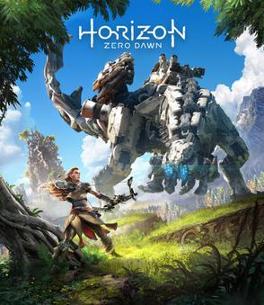

# Games Development

### Game Developer Videos

- [Bethesda - History of Bethesda Game Studios](https://www.youtube.com/watch?v=QKn9yiLVlMM)

- [Classic Game Postmortem: Fallout](https://www.youtube.com/watch?v=T2OxO-4YLRk)

- [GOG: Preserving Gaming's Past & Future](https://www.youtube.com/watch?v=ffngZOB1U2A)

- [Hades - No Clip 6-part documentary](https://www.youtube.com/watch?v=JzyE9hi912c&list=PL-THgg8QnvU4JEVov1tMlFThNYS92F8uC)

- [The Making Of Hollow Knight](https://www.gameinformer.com/2018/10/15/the-making-of-hollow-knight)
- [Hollow Knight - How to design a great metroidvania map](https://www.pcgamer.com/how-to-design-a-great-metroidvania-map/)

- [Horizon Zero Dawn - A Game Design Post-Mortem](http://www.gdcvault.com/play/1024963/-Horizon-Zero-Dawn-A)
- [Horizon Zero Dawn Documentary - Noclip](https://www.youtube.com/watch?v=h9tLcD1r-6w)

- [How to Survive in Gamedev for Eleven Years Without a Hit](https://www.youtube.com/watch?v=JmwbYl6f11c)

- ['Into the Breach' Design Postmortem](https://www.gdcvault.com/browse/gdc-19/play/1025772)

- [Monster Hunter World Post-mortem - Concept Design through Prototyping and Iteration](http://www.gdcvault.com/play/1024981/-Monster-Hunter-World-Postmortem)

- [Motion Matching, The Future of Games Animation... Today - GDC 2016](https://www.youtube.com/watch?v=KSTn3ePDt50)

- [Nier Automata - Design and Freedom](https://www.gdcvault.com/play/1024894/A-Fun-Time-in-Which)
- [How NieR: Automata Tells the Ultimate Humanist Fable](https://www.youtube.com/watch?v=63PzQIbTrM8)

- [Path of Exile - Designing Path of Exile to be Played Forever](https://www.gdcvault.com/play/1025784/Designing-Path-of-Exile-to)

- [Practical Procedural Generation for Everyone - GDC](https://www.youtube.com/watch?v=WumyfLEa6bU)

- [Warframe Documentary (Part One) - The Story of Digital Extremes ](https://www.youtube.com/watch?v=UOE6528pwFc)
- [Warframe Documentary (Part Two) - The Story of Warframe ](https://www.youtube.com/watch?v=NA5vT1LooXk)

- [The Unbearable Now: An Interpretation of The Witness](https://www.youtube.com/watch?v=NOJC62t4JfA)

- [Zelda - Change and Constant: Breaking Conventions with 'The Legend of Zelda: Breath of the Wild'](http://www.gdcvault.com/play/1024562/Change-and-Constant-Breaking-Conventions)

- [Ask the Developer Vol. 6, Xenoblade Chronicles 3–Part 1](https://www.nintendo.com/whatsnew/ask-the-developer-vol-6-xenoblade-chronicles-3-part-1/)

- [Ask the Developer Vol. 6, Xenoblade Chronicles 3–Part 2](https://www.nintendo.com/whatsnew/ask-the-developer-vol-6-xenoblade-chronicles-3-part-2/)

- [Ask the Developer Vol. 6, Xenoblade Chronicles 3–Part 3](https://www.nintendo.com/whatsnew/ask-the-developer-vol-6-xenoblade-chronicles-3-part-3/)

### Game Developer Websites

- [Ask a Game Dev](http://askagamedev.tumblr.com/)

- [GamesIndustry.biz](https://www.gamesindustry.biz)

### Music

- [BBC Radio3 - Sound of Gaming](https://www.bbc.co.uk/programmes/m0009rfp)
- [Fire Emblem Gaiden (NES OST)](https://www.youtube.com/watch?v=Bkh3mx-b6h4&list=PLEOQ0YA_1DWmr3X-yG2-bjUjJs8f_ODau)
- [Fire Emblem Gaiden (NES OST) - Player's turn Celica](https://www.youtube.com/watch?v=OtlTenivqa4)
- [Zelda II The Adventure of Link Music: Palace Theme](https://www.youtube.com/watch?v=7a7Sh82Mzdc)
